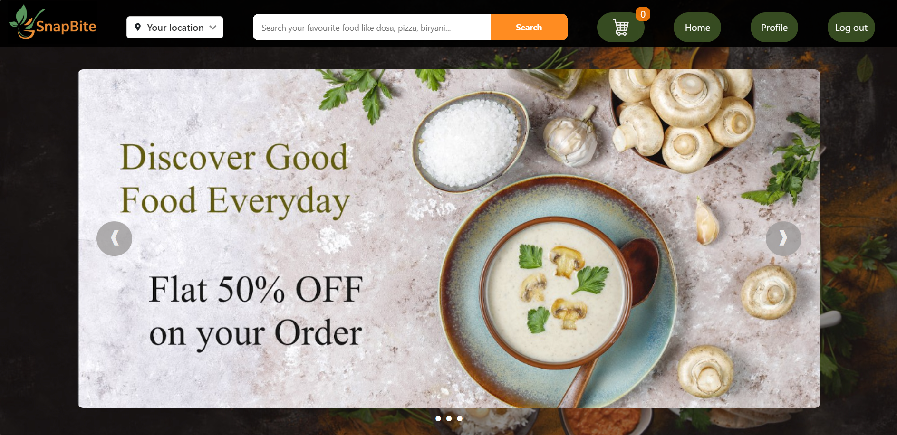
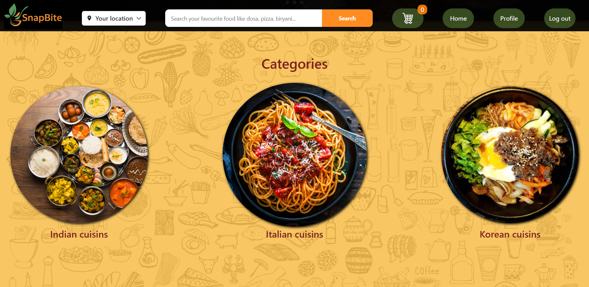
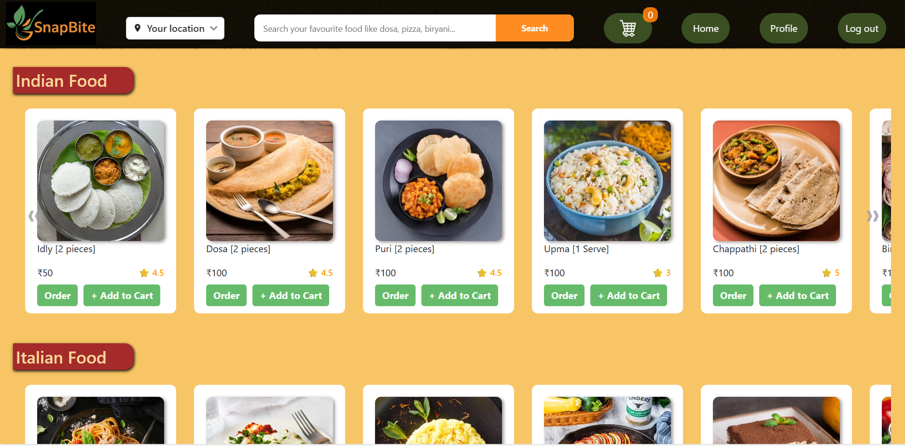
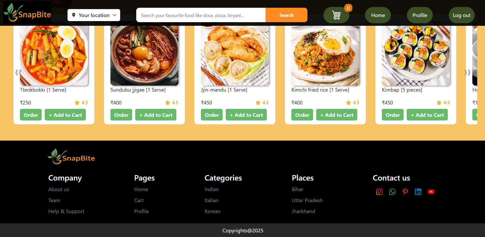
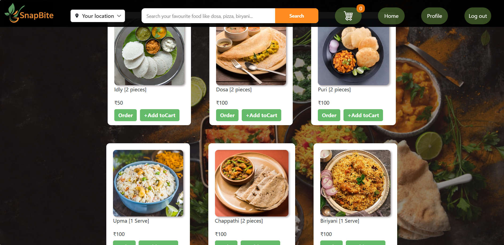
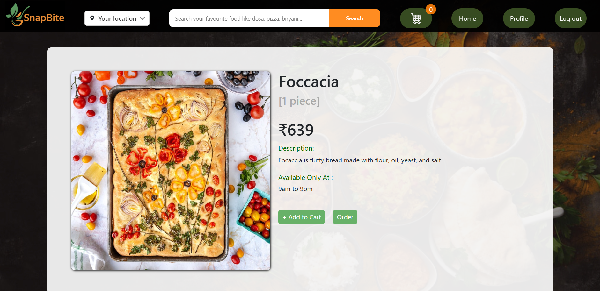
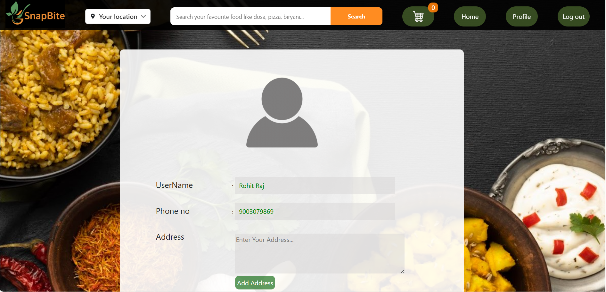
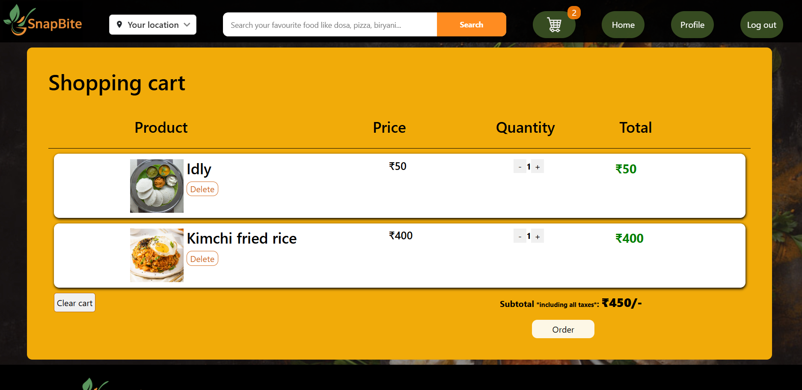

# 🍔 React Food Ordering App

Welcome to the Food Ordering Website project! This is a mini food ordering app built with **React.js**, **Redux**, **HTML**, and **CSS** for ordering food online. The website includes features such as user authentication, a home page with a menu, category pages, detailed food pages, a user profile, and a shopping cart.

---

## 📸 Screenshots

### Login Page  

### Register Page  

### Home Page  
  
  
  

### Category Page  

### Single Food Page  

### Profile Page  

### Cart Page  

---

## ✨ Features

- **User Authentication**: Users can register and log in. User data is stored in local storage for simplicity.
- **Home Page**: Features a top menu, an image slider for ads, and food categories.
- **Category Pages**: Displays food items by cuisine.
- **Single Food Page**: Detailed view of each food item.
- **Cart Page**:  
  - Add to cart  
  - Delete item  
  - Clear cart  
  - Update quantity  
  - Responsive total  
- **Profile Page**: Edit/view user details.

---

## 🛠 Technologies Used

- React.js  
- Redux  
- HTML  
- CSS

---

## 🚀 Available Scripts

In the project directory, you can run:

### `npm start`
Runs the app in development mode.  
Open [http://localhost:3000](http://localhost:3000) to view it in your browser.

### `npm run build`
Builds the app for production to the `build` folder.  
It optimizes the build for the best performance.

### `npm test`
Launches the test runner in watch mode.

### `npm run eject`
⚠️ **Warning**: This is a one-way operation. Once you `eject`, you can’t go back!

---

## 📚 Learn More

- [Create React App Docs](https://facebook.github.io/create-react-app/docs/getting-started)
- [React Documentation](https://reactjs.org/)
- [Deployment Guide](https://facebook.github.io/create-react-app/docs/deployment)
